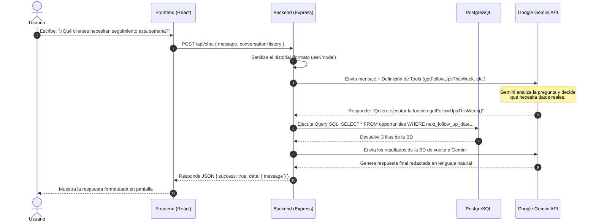

# 📘 Guía de Explicación del Proyecto para Desarrolladores Junior

> **Propósito de este documento:** Esta guía está diseñada para que un desarrollador Junior pueda comprender en profundidad la arquitectura, el flujo de datos y las decisiones técnicas de este sistema, y sea capaz de **explicarlo con confianza** en una demo, presentación o entrevista técnica.

---

## 🎯 1. El "Elevator Pitch" (Explicación en 30 segundos)

> *"Este proyecto es un **Mini CRM comercial con un Asistente de IA integrado**. Permite gestionar oportunidades de venta (crear, editar, filtrar, paginar y eliminar) y cuenta con un chatbot impulsado por **Google Gemini 3.1 Flash Lite**. Lo especial del chatbot es que utiliza **Function Calling** y **RAG**: no inventa respuestas ni tiene datos desactualizados, sino que consulta directamente la base de datos PostgreSQL en tiempo real y documentos adjuntos para dar respuestas exactas sobre las ventas."*

---

## 🏗️ 2. Arquitectura del Sistema (Las 3 Capas + WebSockets)

El proyecto está diseñado como un **Monolito Modular** separado en dos carpetas principales (`frontend` y `backend`):

```
┌─────────────────────────┐     HTTP / WebSockets     ┌─────────────────────────┐        SQL Directo        ┌─────────────────┐
│        FRONTEND         │ ────────────────────────► │         BACKEND         │ ────────────────────────► │  BASE DE DATOS  │
│  React 19 + Bootstrap 5 │ ◄──────────────────────── │   Node.js + Express API │ ◄──────────────────────── │  PostgreSQL 16  │
│   Vite SPA + Socket.io  │    (JWT Interceptor)      │ (JWT Auth + Socket.io)  │                           │                 │
└─────────────────────────┘                           └────────────┬────────────┘                           └─────────────────┘
                                                                   │
                                                                   │ Function Calling (8 Tools)
                                                                   ▼
                                                      ┌─────────────────────────┐
                                                      │      GOOGLE GEMINI      │
                                                      │ (gemini-3.1-flash-lite) │
                                                      └─────────────────────────┘
```

### A. Frontend (La Interfaz)
- **Tecnología:** React 19 + Vite + React Bootstrap + Socket.io Client.
- **Responsabilidad:** Presentar una interfaz ágil al usuario. Tiene dos vistas principales:
  1. **CRUD de Oportunidades & KPIs:** Tabla responsiva con paginación, filtros por estado/prioridad/responsable, exportación CSV e indicador WebSocket `🟢 En Vivo`.
  2. **Copilot Comercial (Chat UI):** Interfaz de chat conversacional con Markdown integrado.

### B. Backend (El Cerebro de Negocio y API)
- **Tecnología:** Node.js + Express + Socket.io.
- **Responsabilidad:** Exponer endpoints REST (`/api/opportunities`, `/api/chat`), conectar con la base de datos PostgreSQL, transmitir mutaciones en tiempo real por WebSockets y coordinar la comunicación entre el usuario y la IA de Google Gemini 3.1 Flash Lite.


### C. Base de Datos (El Almacenamiento)
- **Tecnología:** PostgreSQL 16.
- **Responsabilidad:** Almacenar de forma persistente las oportunidades comerciales en la tabla `opportunities` e historial de chats en `chat_history`. Usa tipos nativos como `UUID` para IDs y `ENUM` para validar estados y prioridades.

---

## 🔄 3. El Flujo Completo: ¿Qué pasa cuando el usuario consulta al Chatbot?

Este es el flujo más importante que debes saber explicar paso a paso:



### Paso a paso contado en palabras sencillas:
1. **El usuario pregunta** algo en el chat (ej. *"¿Cuáles son los clientes con mayor probabilidad de cierre?"*).
2. **El Frontend envía** la pregunta al endpoint `/api/chat` del Backend.
3. **El Backend prepara a Gemini:** Le pasa el mensaje del usuario y le entrega un "estuche de herramientas" (Tools / Function Calling & RAG), diciéndole: *"Tengo estas 8 funciones para consultar la base de datos y documentos de oportunidades si las necesitas"*.

4. **Gemini decide qué herramienta usar:** La IA detecta que la pregunta requiere datos reales y responde diciendo *"Ejecuta la función `getTopByProbability`"*.
5. **El Backend ejecuta el SQL:** El Backend llama a PostgreSQL, hace la consulta SQL y obtiene las oportunidades reales.
6. **El Backend le responde a Gemini:** Le entrega los datos obtenidos de la BD a Gemini.
7. **Gemini redacta la respuesta:** Con los datos reales en la mano, Gemini redacta una respuesta clara en español.
8. **El usuario ve el resultado:** La respuesta llega al frontend y se renderiza elegantemente.

---

## 💡 4. La Magia Clave: ¿Qué es Function Calling y por qué lo usamos?

Si te preguntan en una entrevista **"¿Por qué no le pasaste toda la base de datos a la IA en el prompt?"**, la respuesta es:

1. **Costo y Límites de Tokens:** Enviar miles de filas de base de datos en cada mensaje es muy costoso y supera el límite de contexto.
2. **Seguridad y Privacidad:** Solo consultamos exactamente los datos necesarios para la pregunta.
3. **Cero Alucinaciones:** Al obligar a la IA a consultar funciones que leen la BD real, se evita que la IA invente clientes o montos falsos.

---

## 🛠️ 5. Decisiones Técnicas: "Por qué elegimos esta tecnología"

Prepárate para justificar las decisiones del proyecto:

| Decisión | ¿Por qué se eligió? | Alternativa descartada y motivo |
|---|---|---|
| **Monolito Modular** | Mantiene el proyecto simple, rápido de desplegar y fácil de entender. | **Microservicios:** Añade demasiada complejidad innecesaria para un CRM de este tamaño. |
| **Driver SQL nativo (`pg`)** | Da control total de las queries SQL, máximo rendimiento y sin sobrecarga. | **ORMs pesados (Prisma/Sequelize):** Innecesarios para esquemas sencillos de pocas tablas. |
| **Vite** | Reemplazo moderno de CRA, compilación instantánea y HMR (Hot Module Replacement) ultra rápido. | **Create React App (CRA):** Está descontinuado/deprecated desde hace años. |
| **System Prompt en `.md`** | Permite versionar la personalidad y reglas de la IA en Git sin tocar código JS. | **Hardcodeado en código:** Difícil de mantener y probar. |

---

## ❓ 6. Preguntas Frecuentes de Entrevista (FAQ)

### P1: ¿Cómo manejaron la compatibilidad del historial con Gemini?
> **Respuesta:** *"Google Gemini exige que el historial alterne estrictamente entre roles `user` y `model`, y que el primer mensaje siempre sea del `user`. En el backend creamos una función helper (`formatChatHistory`) que sanitiza el array convirtiendo roles, descartando el mensaje estático inicial del chatbot si existe, y asegurando la secuencia correcta antes de llamar a `startChat()`."*

### P2: ¿Qué pasa si falla la base de datos o la API Key?
> **Respuesta:** *"El backend tiene bloques `try/catch` centralizados en la capa de servicios y controladores. Si la API Key es inválida o PostgreSQL no responde, el sistema no se cae; devuelve un mensaje de error controlado y amigable al usuario notificándole el problema."*

### P3: ¿Cómo validan los datos que ingresa el usuario en una nueva oportunidad?
> **Respuesta:** *"Usamos una doble capa de validación: en el backend usamos `express-validator` para validar tipos de datos, formatos de email y montos positivos antes de tocar la base de datos, y en la base de datos PostgreSQL usamos tipos `ENUM` y `CHECK` para garantizar integridad de datos a nivel de motor."*

---

## 🚀 7. Resumen de comandos clave para demostrar el proyecto

```bash
# 1. Iniciar Base de datos y Backend
cd backend
npm run dev

# 2. Iniciar Frontend (en otra terminal)
cd frontend
npm run dev

# 3. Probar el endpoint de salud (Health check)
curl http://localhost:3001/api/health
```

---
*¡Con este documento estás listo para presentar, explicar y defender el proyecto como todo un profesional!* 🎓
