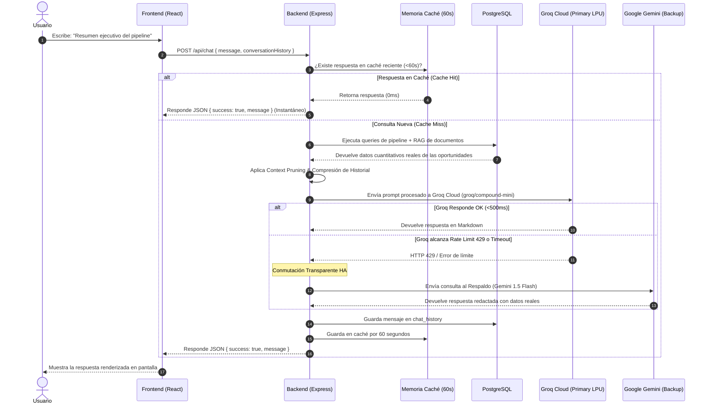

# 📘 Guía de Explicación del Proyecto para Desarrolladores Junior

> **Propósito de este documento:** Esta guía está diseñada para que un desarrollador Junior pueda comprender en profundidad la arquitectura, el flujo de datos y las decisiones técnicas de este sistema, y sea capaz de **explicarlo con total confianza** en una demo, presentación de código o entrevista técnica.

---

## 🎯 1. El "Elevator Pitch" (Explicación en 30 segundos)

> *"Este proyecto es un **Mini CRM comercial con un Asistente de IA de Alta Disponibilidad integrado**. Permite gestionar oportunidades de venta (crear, editar, filtrar, paginar y eliminar) y cuenta con un Copilot Comercial impulsado por **Groq Cloud (LPUs)** y **Google Gemini como respaldo automático**. Lo especial del chatbot es que utiliza **RAG** e **Inyección SQL en Tiempo Real**: no inventa respuestas ni tiene datos desactualizados, sino que analiza la base de datos PostgreSQL e historial de interacciones con una latencia de respuesta inferior a 500ms y tolerancia total a fallos."*

---

## 🏗️ 2. Arquitectura del Sistema (3 Capas + WebSockets + Multi-Provider AI)

El proyecto está diseñado como un **Monolito Modular** separado en dos carpetas principales (`frontend` y `backend`):

```
┌─────────────────────────┐     HTTP / WebSockets     ┌─────────────────────────┐        SQL Directo        ┌─────────────────┐
│        FRONTEND         │ ────────────────────────► │         BACKEND         │ ────────────────────────► │  BASE DE DATOS  │
│  React 19 + Bootstrap 5 │ ◄──────────────────────── │   Node.js + Express API │ ◄──────────────────────── │  PostgreSQL 16  │
│   Vite SPA + Socket.io  │   (JWT + Auto-Reconnect)  │ (JWT Auth + Socket.io)  │                           │                 │
└─────────────────────────┘                           └────────────┬────────────┘                           └─────────────────┘
                                                                   │
                                                      ┌────────────┴────────────┐
                                                      │  MOTOR DE IA DUAL (HA)  │
                                                      ├─────────────────────────┤
                                                      │ 1. Groq Cloud (Primary) │  <-- LPU Inferencia <500ms
                                                      │ 2. Gemini 1.5 (Backup)  │  <-- Respaldo automático 429
                                                      └─────────────────────────┘
```

### A. Frontend (La Interfaz)
- **Tecnología:** React 19 + Vite + React Bootstrap + Socket.io Client.
- **Responsabilidades:**
  1. **CRUD de Oportunidades & KPIs:** Tabla responsiva con paginación, filtros por estado/prioridad/responsable, exportación CSV e indicador WebSocket `🟢 En Vivo`.
  2. **Copilot Comercial (Chat UI):** Interfaz conversacional con renderizado de Markdown, botones de consulta rápida y captura inteligente de errores.

### B. Backend (El Cerebro de Negocio y API)
- **Tecnología:** Node.js (Express) + Socket.io + Groq SDK / Google Generative AI SDK.
- **Responsabilidades:** Exponer endpoints REST (`/api/opportunities`, `/api/chat`), conectar con PostgreSQL, emitir mutaciones en tiempo real por WebSockets y orquestar el flujo de IA de **Alta Disponibilidad Multi-Proveedor**.

### C. Base de Datos (El Almacenamiento Persistente)
- **Tecnología:** PostgreSQL 16 (local / Cloud Neon).
- **Responsabilidades:** Almacenar oportunidades en `opportunities` e historial de conversación en `chat_history`. Utiliza tipos nativos `UUID` para llaves primarias y `ENUM` / `CHECK` constraints para integridad de datos.

---

## 🔄 3. El Flujo Completo: ¿Qué pasa cuando el usuario consulta al Chatbot?

Este es el flujo más importante que debes saber explicar paso a paso:



---

## 💡 4. Conceptos Clave de Arquitectura Explicados para un Jr.

Si te preguntan en una entrevista sobre los aspectos más avanzados del sistema, aquí tienes cómo explicarlos:

### 1. ¿Por qué usamos Groq Cloud en lugar de usar solo una API tradicional?
> **Explicación:** Groq no usa GPUs convencionales; utiliza **LPUs (Language Processing Units)** diseñadas específicamente para modelos de lenguaje. Esto permite generar más de 500 tokens por segundo, reduciendo la latencia del chat de 3-5 segundos a **menos de 500 milisegundos**.

### 2. ¿Qué es la Arquitectura de Alta Disponibilidad Multi-Proveedor (HA)?
> **Explicación:** Las APIs gratuitas de IA imponen límites de peticiones por minuto (`429 Rate Limit`). Para que la aplicación **nunca se caiga**, implementamos un patrón de circuito primario/secundario: la app intenta con Groq Cloud; si Groq está saturado, conmuta de forma **transparente** a Google Gemini. El usuario siempre recibe su respuesta sin ver mensajes de error.

### 3. ¿Qué es Context Pruning y Compresión de Historial?
> **Explicación:** Si le enviamos todas las respuestas pasadas y toda la base de datos a la IA en cada mensaje, la ventana de contexto explota en tamaño y supera los límites de la API. Aplicamos dos técnicas:
> 1. **Context Pruning:** Si el usuario pregunta por una empresa específica (ej: *"BancaDigital"*), el backend filtra la BD y le envía a la IA solo esa empresa.
> 2. **Compresión de Historial:** Las respuestas pasadas del asistente se truncan a 250 caracteres. Esto reduce el consumo de tokens en un **80%**, evitando bloqueos por TPM (Tokens Per Minute).

### 4. ¿Por qué se caían los WebSockets y cómo se solucionó?
> **Explicación:** Ocurría por tres motivos:
> 1. **Upgrade de transporte:** Socket.io intentaba cambiar de HTTP Polling a WebSocket puro en caliente. Lo solucionamos fijando `transports: ['websocket', 'polling']`.
> 2. **Heartbeat:** Agregamos `pingTimeout: 60s` para que el socket no expire mientras la IA procesa respuestas.
> 3. **Reinicios de Node:** En desarrollo, `node --watch` reiniciaba el backend al escribir archivos. Agregamos `--watch-path=src` en `package.json` para que Node solo vigile el código fuente.

---

## 🛠️ 5. Tabla de Decisiones Técnicas y Justificación

| Decisión Técnica | ¿Por qué se eligió? | Alternativa descartada y motivo |
|---|---|---|
| **Groq Cloud (LPU)** | Inferencia ultrarrápida (<500ms) para una experiencia conversacional fluida. | APIs tradicionales de alta latencia (3-5s de espera). |
| **Respaldo con Google Gemini** | Garantiza tolerancia a fallos si Groq alcanza el límite de velocidad por minuto. | Fallar y mostrar un mensaje de error feo al usuario. |
| **Driver `pg` nativo** | Control total de consultas SQL, cero sobrecarga y máxima velocidad. | ORMs como Prisma/Sequelize que agregan capas innecesarias. |
| **Vite** | Build tool moderno, HMR instantáneo en desarrollo y bundles livianos en producción. | Create React App (CRA), el cual está descontinuado desde 2023. |
| **Caché LRU (60s)** | Atiende clics repetidos en 0ms y ahorra cuota de llamadas API. | Consultar la API externa por cada clic del usuario. |

---

## ❓ 6. Preguntas Frecuentes de Entrevista (FAQ)

### P1: ¿Cómo evitan las alucinaciones de la IA?
> **Respuesta:** *"Limitamos a la IA usando un System Prompt restrictivo en Markdown (`system-prompt-v1.md`), inyectando exclusivamente datos reales de la BD PostgreSQL en tiempo real y configurando una temperatura baja (0.3) para que las respuestas sean puramente factuales."*

### P2: ¿Cómo manejan la seguridad y autenticación en los WebSockets y la API?
> **Respuesta:** *"Utilizamos tokens JWT (JSON Web Tokens) transmitidos en la cabecera `Authorization: Bearer <token>`. El backend cuenta con un middleware `authenticateToken` que verifica la firma y resguarda las rutas ante accesos no autorizados."*

### P3: ¿Por qué eligieron una arquitectura de Monolito Modular?
> **Respuesta:** *"Porque para un CRM de este alcance, dividir en microservicios agregaría latencia de red, complejidad de despliegue y sobrecarga de orquestación sin aportar beneficios reales. El monolito modular en carpetas `frontend/` y `backend/` mantiene la separación de capas limpia y fácil de mantener."*

---

## 🚀 7. Resumen de Comandos Ejecutables

```bash
# Terminal 1: Backend
cd backend
npm run dev

# Terminal 2: Frontend
cd frontend
npm run dev

# Probar Endpoint de Salud
curl http://localhost:3001/api/health
```

---
*¡Con este documento estás listo para presentar, explicar y defender el proyecto como todo un profesional!* 🎓
